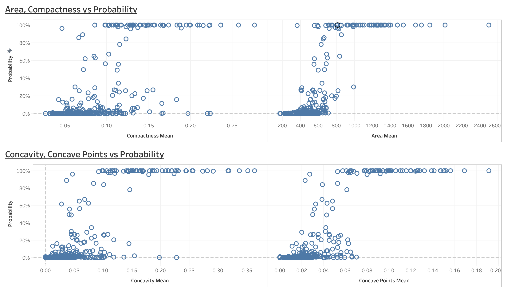
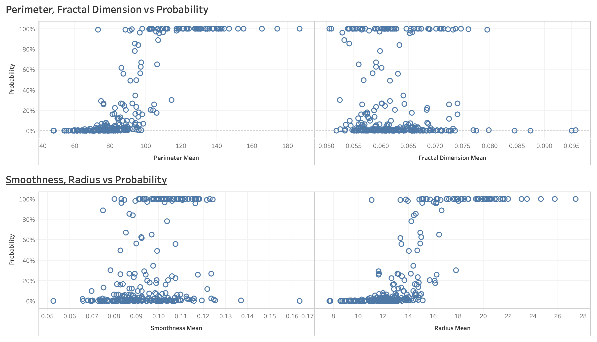
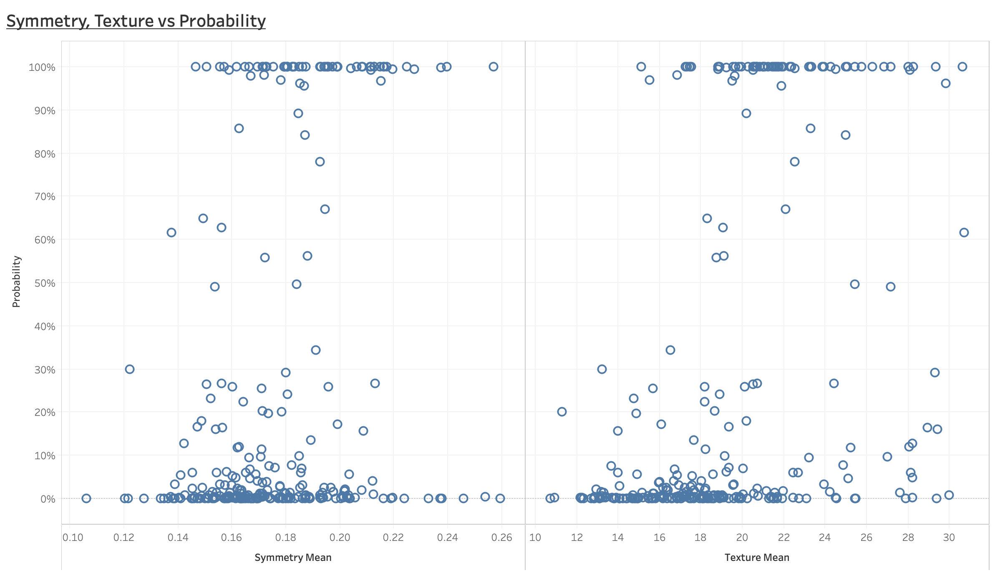

# Breast Cancer Logistic Regression

## Background

As someone who is driven in understanding what the chances of a disease having serious effect on a person, I wanted to be able to dive into this dataset to understand the probabilities of breast cancer being benign or malignant based on characteristics that are focused on.

## Findings

For each respective mean in the four charts above, we see that Area, Compactness, Concavity, and Concave all seem to have a probability of being benign at the lower values of their x-axes.
 
 
 
For each respective mean in the four charts above, we see that Area, Compactness, Concavity, and Concave all seem to have a probability of being benign at the lower values of their x-axes.
 
 

Here, the probabilities vary a little differently along the mean axes. While most cases are still benign, we see that for Fractal Dimension and Smoothness, it is a little less obvious to say that if a value falls under a certain range, then it’ll be considered benign or malignant. This is not the case for the Perimeter and Radius means however. We can clearly see that it is much easier to interpret the probability of an existing case of breast cancer or not.
  
 
 
Symmetry and Texture means behave more like Smoothness and Fractal Dimension. There is a less linear pattern of a mean value being able to show the probability of breast cancer being malignant or benign.
